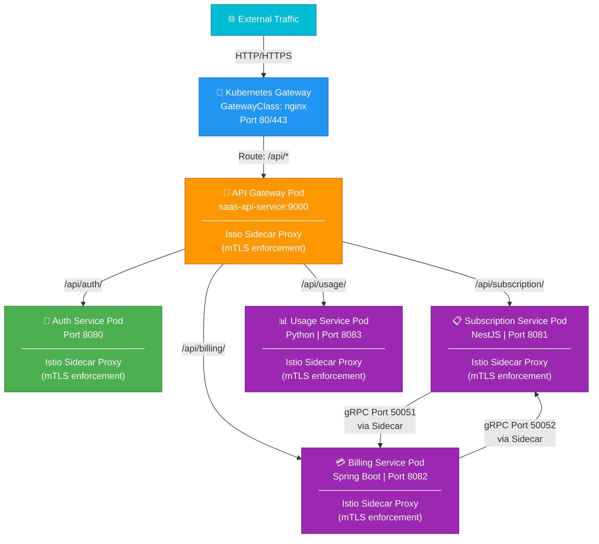

# SaaS Continuous Delivery


GitOps-based continuous delivery repository for the SaaS platform. Uses **individual Helm charts** for each microservice (in `charts/`), an **orchestration chart** (`saas-chart/`) for API Gateway and infrastructure, and **environment-specific Kustomize overlays** (in `manifests/`) for ArgoCD-based deployments across dev, staging, and production.

## What's Deployed

| Component | Type | Description |
|---|---|---|
| api-gateway | Service | Go API gateway (port 9000) |
| auth-service | Service | Authentication service (port 8080) |
| subscription-service | Service | NestJS subscription management (port 8081) |
| billing-service | Service | Spring Boot billing & payments (port 8082) |
| usage-service | Service | Python usage analytics (port 8083) |
| Keycloak | Identity | OIDC provider for JWT issuance |
| Apache Airflow | Orchestration | Usage data pipeline scheduler |
| OpenTelemetry Collector | Observability | Telemetry aggregation (DaemonSet) |
| Grafana + Loki + Tempo + Prometheus | Observability | Metrics, logs, and traces stack |
| Istio | Service Mesh | mTLS, traffic management, sidecar injection |

## Repository Structure

```
saas-continious-delivery/
├── charts/                              # Individual microservice Helm charts
│   ├── auth-service/                    # Authentication service chart
│   │   ├── Chart.yaml
│   │   ├── values.yaml
│   │   ├── values-dev.yaml
│   │   ├── values-prod.yaml
│   │   ├── values-staging.yaml
│   │   └── templates/
│   │       └── deployment.yaml
│   ├── billing-service/                 # Billing & payments service chart
│   │   ├── Chart.yaml
│   │   ├── values.yaml
│   │   ├── values-dev.yaml
│   │   ├── values-prod.yaml
│   │   ├── values-staging.yaml
│   │   └── templates/
│   │       └── deployment.yaml
│   ├── subscription-service/            # Subscription management service chart
│   │   ├── Chart.yaml
│   │   ├── values.yaml
│   │   ├── values-dev.yaml
│   │   ├── values-prod.yaml
│   │   ├── values-staging.yaml
│   │   └── templates/
│   │       └── deployment.yaml
│   └── usage-service/                   # Usage analytics service chart
│       ├── Chart.yaml
│       ├── values.yaml
│       ├── values-dev.yaml
│       ├── values-prod.yaml
│       ├── values-staging.yaml
│       └── templates/
│           └── deployment.yaml
├── saas-chart/                          # Master Helm chart for infrastructure & API Gateway
│   ├── Chart.yaml                       # Chart metadata + dependencies
│   ├── Chart.lock                       # Locked dependency versions
│   ├── charts/                          # Bundled chart dependencies
│   │   └── opentelemetry-collector-0.100.0.tgz
│   ├── templates/
│   │   ├── api-gateway.yaml             # API Gateway Deployment + Service
│   │   ├── gateway.yaml                 # Istio Gateway resource
│   │   ├── gateway-http.yaml            # HTTP Gateway route configuration
│   │   ├── httproute.yaml               # HTTP routing rules
│   │   ├── peer-authentication.yaml     # Istio mTLS enforcement
│   │   ├── service.yaml                 # Service definitions
│   │   ├── serviceaccount.yaml          # RBAC service accounts
│   │   ├── hpa.yaml                     # Horizontal Pod Autoscaler
│   │   ├── ingress.yaml                 # Ingress configuration
│   │   ├── _helpers.tpl                 # Helm template helpers
│   │   ├── NOTES.txt                    # Helm chart notes
│   │   └── tests/
│   │       ├── test-connection.yaml
│   │       └── api-gateway-test.yaml
│   ├── gateway-api-crds.yaml            # Kubernetes Gateway API CRDs
│   ├── values.yaml                      # Default values
│   ├── values-dev.yaml                  # Dev environment overrides
│   ├── values-test.yaml                 # Test environment overrides
│   ├── values-staging.yaml              # Staging environment overrides
│   └── values-prod.yaml                 # Production environment overrides
├── manifests/                           # Kustomize overlays for ArgoCD deployments
│   └── base/
│       └── overlays/
│           ├── dev/                     # Development environment
│           │   ├── root.yaml            # ArgoCD App-of-Apps root
│           │   ├── kustomization.yaml
│           │   ├── application/
│           │   │   └── applications.yaml    # Microservice application resources
│           │   ├── airflow/                 # Airflow orchestration (dev)
│           │   ├── keycloak/                # Keycloak identity provider (dev)
│           │   └── observability/
│           │       └── grafana-stack/       # Prometheus, Loki, Grafana (dev)
│           ├── staging/                 # Staging environment
│           │   ├── root.yaml            # ArgoCD App-of-Apps root
│           │   ├── kustomization.yaml
│           │   ├── application/
│           │   │   └── applications.yaml
│           │   ├── observability/
│           │   │   └── elk-stack/           # Elasticsearch, Kibana (staging)
│           │   └── keycloak/
│           └── prod/                    # Production environment
│               ├── root.yaml            # ArgoCD App-of-Apps root
│               ├── kustomization.yaml
│               ├── application/
│               │   └── applications.yaml
│               ├── airflow/                 # Airflow (prod)
│               ├── keycloak/                # Keycloak (prod)
│               ├── cert-manager/            # TLS certificate automation
│               ├── external-dns/            # Route53/DNS integration
│               ├── external-secret/         # Secrets management
│               └── karpenter/               # Auto-scaling node provisioning
└── CHART-PUSH.md                        # Guide for pushing charts to ECR
```

**Key Directories:**

- **`charts/`**: Individual Helm charts for each microservice, published to ECR and consumed by ArgoCD
- **`saas-chart/`**: Orchestration chart for API Gateway, Istio configuration, and shared infrastructure components
- **`manifests/base/overlays/`**: Environment-specific Kustomize configurations for ArgoCD GitOps deployments
  - Each environment overlay defines which services and infrastructure components are deployed
  - Uses ArgoCD Application resources to manage releases

## Architecture Overview

The system follows a microservices architecture with Kubernetes Gateway API for ingress and Istio service mesh for inter-service communication:



**Architecture Details:**

- **Kubernetes Gateway** (GatewayClass: nginx): Handles external ingress traffic and TLS termination
- **API Gateway Service**: Routes HTTP requests to backend microservices
- **Istio Service Mesh**: 
  - Automatically injects a sidecar proxy into each service pod (when enabled)
  - Sidecars intercept all inter-service traffic
  - Enforces **mTLS** (mutual TLS) for encrypted, authenticated service-to-service communication
  - Enables traffic management, retries, circuit breaking, and observability
- **Service-to-Service Communication**: All traffic flows through Istio sidecars for security and observability

## Environments

| Environment | Values File | Observability Backend | Notes |
|---|---|---|---|
| `dev` | `values-dev.yaml` | Loki + Tempo + Prometheus (Grafana) | Debug verbosity, OTel debug exporter |
| `test` | `values-test.yaml` | — | Minimal config for CI |
| `staging` | `values-staging.yaml` | Elastic APM + Elasticsearch + Logstash | Full ELK stack |
| `prod` | `values-prod.yaml` | Configurable | TLS enabled, higher replicas |

## Prerequisites

- Kubernetes cluster (1.28+)
- Helm 3.14+
- ArgoCD installed in the cluster
- `kubectl` configured for your cluster
- Istio installed (if `istio.enabled: true`)

## Helm Chart Usage

### Install / Upgrade with ArgoCD (Recommended)

The recommended way to deploy is via **ArgoCD GitOps**. See the [ArgoCD GitOps Setup](#argocd-gitops-setup) section below.

### Manual Installation (Dev/Testing)

For development or testing environments, you can install charts manually:

```bash
# 1. Add OTel Helm repo (dependency for saas-chart)
helm repo add open-telemetry https://open-telemetry.github.io/opentelemetry-helm-charts
helm repo update

# 2. Update chart dependencies
helm dependency update saas-chart/

# 3. Install infrastructure chart (API Gateway, Istio config, etc.)
helm upgrade --install saas saas-chart/ \
  -f saas-chart/values-dev.yaml \
  --namespace saas-dev \
  --create-namespace

# 4. Install individual microservice charts
# (Assumes charts are published to a Helm repo or available locally)
helm upgrade --install auth-service charts/auth-service/ \
  -f charts/auth-service/values-dev.yaml \
  --namespace saas-dev

helm upgrade --install billing-service charts/billing-service/ \
  -f charts/billing-service/values-dev.yaml \
  --namespace saas-dev

helm upgrade --install subscription-service charts/subscription-service/ \
  -f charts/subscription-service/values-dev.yaml \
  --namespace saas-dev

helm upgrade --install usage-service charts/usage-service/ \
  -f charts/usage-service/values-dev.yaml \
  --namespace saas-dev

# 5. Install Gateway API CRDs (first time only)
kubectl apply -f saas-chart/gateway-api-crds.yaml
```

### Dry Run / Template

```bash
# Preview rendered manifests for saas-chart
helm template saas saas-chart/ -f saas-chart/values-dev.yaml

# Dry run
helm upgrade --install saas saas-chart/ \
  -f saas-chart/values-dev.yaml \
  --dry-run
```

### Run Helm Tests

```bash
helm test saas --namespace saas-dev
```

## ArgoCD GitOps Setup

The `manifests/` directory uses an **App-of-Apps** pattern. A root ArgoCD Application in each environment (`manifests/base/overlays/<env>/root.yaml`) orchestrates all child applications, which in turn deploy microservices using the individual Helm charts from `charts/`.

### Deployment Flow

1. **Root Application** (`root.yaml`) — Points to all child applications
2. **Child Applications** — Each references a Helm chart:
   - `auth-service` ArgoCD Application → `charts/auth-service/` Helm chart
   - `billing-service` ArgoCD Application → `charts/billing-service/` Helm chart
   - `subscription-service` ArgoCD Application → `charts/subscription-service/` Helm chart
   - `usage-service` ArgoCD Application → `charts/usage-service/` Helm chart
   - Infrastructure apps (Keycloak, Airflow, Observability, etc.)
3. **Infrastructure Chart** (`saas-chart/`) — Deployed for API Gateway, Istio, and networking

### Bootstrap Dev Environment

```bash
# Apply the root ArgoCD application
kubectl apply -f manifests/base/overlays/dev/root.yaml -n argocd
```

ArgoCD will then automatically sync all child applications:
- The `auth-service`, `billing-service`, `subscription-service`, `usage-service` microservices
- The `saas-chart` infrastructure (API Gateway, Istio Gateway, mTLS config)
- Keycloak (identity provider)
- Airflow (data pipeline orchestration)
- Grafana stack (Prometheus + Loki)

### Bootstrap Staging Environment

```bash
kubectl apply -f manifests/base/overlays/staging/root.yaml -n argocd
```

Syncs microservices + ELK stack (Elasticsearch, Kibana) for observability.

### Bootstrap Production Environment

```bash
kubectl apply -f manifests/base/overlays/prod/root.yaml -n argocd
```

Syncs microservices + infrastructure with:
- External DNS (Route53 integration)
- Cert-Manager (automated TLS certificates)
- External Secrets (secrets management)
- Karpenter (auto-scaling node provisioning)
- Higher replicas and resource limits

### Sync Manually

```bash
argocd app sync saas-dev
argocd app sync airflow-dev
argocd app sync keycloak-dev
```

## Key Configuration Values

### API Gateway (saas-chart)

Configuration for the API Gateway is in `saas-chart/values-<env>.yaml`:

```yaml
apiGateway:
  replicas: 2
  port: 9000
  keycloakJWKSURL: "http://keycloak.keycloak.svc.cluster.local:8080/realms/saas/protocol/openid-connect/certs"
  livenessProbe:
    path: /healthz/live
    initialDelaySeconds: 10
    periodSeconds: 10
  readinessProbe:
    path: /healthz/ready
    initialDelaySeconds: 5
    periodSeconds: 5
```

### Microservice Replicas & Ports

Each microservice Helm chart (`charts/<service>/values-<env>.yaml`) defines its own configuration:

```yaml
# charts/auth-service/values-dev.yaml
replicaCount: 2
image:
  repository: ghcr.io/your-org/auth-service
  tag: "latest"
service:
  port: 8080

# Similar structure for billing-service, subscription-service, usage-service
```

### Istio Service Mesh Configuration

Istio is configured in `saas-chart/templates/peer-authentication.yaml` and `saas-chart/values-<env>.yaml`:

```yaml
istio:
  enabled: true
  revision: ""   # Set to Istio revision label for canary upgrades
```

**How it works:**
- When `istio.enabled: true`, all service deployments get the `sidecar.istio.io/inject: "true"` annotation
- Istio's mutating admission webhook automatically injects an Envoy sidecar proxy into each pod
- The sidecar intercepts all inbound and outbound traffic from the main application container
- A `PeerAuthentication` resource enforces **mTLS** (mutual TLS) for all service-to-service communication
- Sidecars provide: traffic encryption, authentication, observability (metrics, logs, traces), retries, circuit breaking

### OpenTelemetry Collector

The bundled OTel Collector runs as a **DaemonSet** and is configured per environment:

- **Dev/Test**: exports traces to Tempo, logs to Loki, metrics to Prometheus
- **Staging**: exports traces to Elastic APM, logs to Elasticsearch + Logstash, metrics to Prometheus

```yaml
opentelemetry-collector:
  enabled: true
  mode: daemonset
```

## Service Communication

```
External Traffic
      │
      ▼
Istio Gateway (nginx GatewayClass)
      │
      ▼
api-gateway (ClusterIP: saas-api-service)
      │
      ├── /api/auth/         → auth-service:8080
      ├── /api/subscription/ → subscription-service:8081
      └── /api/billing/      → billing-service:8082

subscription-service:50051 ←── billing-service (gRPC)
```

## Updating a Microservice

With **ArgoCD GitOps** (recommended):

1. Build and push a new Docker image with a new tag
2. Update the image tag in the relevant `charts/<service>/values-<env>.yaml`
3. Commit and push to Git — ArgoCD will detect the change and automatically sync the Helm release

Example:

```yaml
# charts/billing-service/values-prod.yaml
image:
  repository: ghcr.io/your-org/billing-service
  tag: "v1.2.3"  # Update this
```

Manual update (dev/testing):

```bash
helm upgrade billing-service charts/billing-service/ \
  -f charts/billing-service/values-dev.yaml \
  --set image.tag=v1.2.3 \
  --namespace saas-dev
```

## License

MIT
