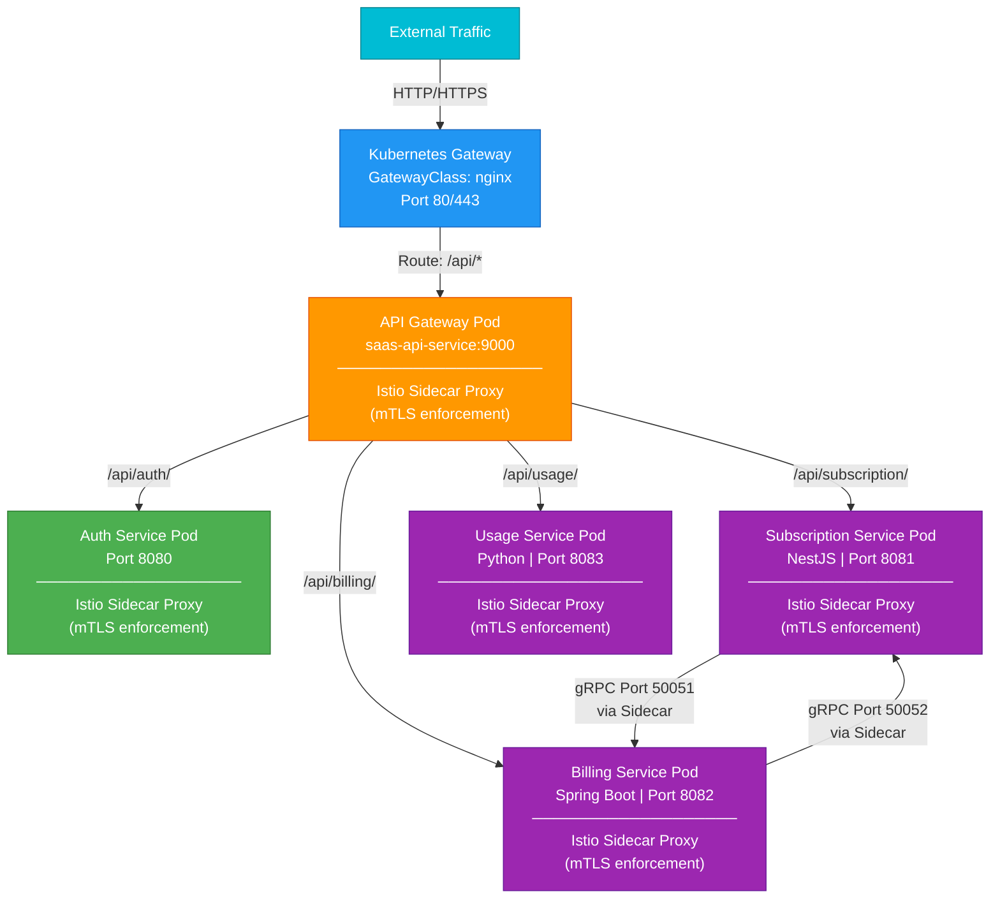

# SaaS Continuous Delivery


GitOps-based continuous delivery repository for the SaaS platform. Uses **individual Helm charts** for each microservice (in `charts/`), an **orchestration chart** (`saas-chart/`) for API Gateway and infrastructure, and **environment-specific Kustomize overlays** (in `infra/overlays/`) for ArgoCD-based deployments across dev, staging, and production.

## What's Deployed

| Component | Type | Description |
|---|---|---|
| api-gateway | Service | Go API gateway (port 9000) |
| auth-service | Service | Authentication service (port 8080) |
| subscription-service | Service | NestJS subscription management (port 8081) |
| billing-service | Service | Spring Boot billing & payments (port 8082) |
| usage-service | Service | Python usage analytics (port 8083) |
| Keycloak | Identity | OIDC provider for JWT issuance |
| Apache Airflow | Orchestration | Usage data pipeline scheduler |
| OpenTelemetry Collector | Observability | Telemetry aggregation (DaemonSet) |
| Grafana + Loki + Tempo + Prometheus | Observability | Metrics, logs, and traces stack |
| Istio | Service Mesh | mTLS, traffic management, sidecar injection |
| KEDA | Autoscaler | Event-driven horizontal pod autoscaling for all services |
| Argo Rollouts | Progressive Delivery | Canary rollouts with Istio traffic shifting + Prometheus analysis |
| Crossplane | Cloud control plane | Manages Postgres databases/roles/grants inside TF-provisioned RDS instances via `AppDatabase` claims |

## Repository Structure

```
saas-continious-delivery/
├── charts/                              # Individual microservice Helm charts
│   ├── auth-service/                    # Authentication service chart
│   │   ├── Chart.yaml
│   │   ├── values.yaml
│   │   ├── values-dev.yaml
│   │   ├── values-prod.yaml
│   │   ├── values-staging.yaml
│   │   ├── values.schema.json           # Generated from CUE — enforced by Helm
│   │   └── templates/
│   │       ├── deployment.yaml         # renders argoproj.io/Rollout (canary + Istio)
│   │       ├── analysistemplate.yaml   # Prometheus success-rate + p95 latency gates
│   │       └── scaledobject.yaml       # KEDA targets the Rollout (not Deployment)        # KEDA ScaledObject (gated by keda.enabled)
│   ├── billing-service/                 # Billing & payments service chart
│   │   ├── Chart.yaml
│   │   ├── values.yaml
│   │   ├── values-dev.yaml
│   │   ├── values-prod.yaml
│   │   ├── values-staging.yaml
│   │   ├── values.schema.json
│   │   └── templates/
│   │       ├── deployment.yaml         # renders argoproj.io/Rollout (canary + Istio)
│   │       ├── analysistemplate.yaml   # Prometheus success-rate + p95 latency gates
│   │       └── scaledobject.yaml       # KEDA targets the Rollout (not Deployment)
│   ├── subscription-service/            # Subscription management service chart
│   │   ├── Chart.yaml
│   │   ├── values.yaml
│   │   ├── values-dev.yaml
│   │   ├── values-prod.yaml
│   │   ├── values-staging.yaml
│   │   ├── values.schema.json
│   │   └── templates/
│   │       ├── deployment.yaml         # renders argoproj.io/Rollout (canary + Istio)
│   │       ├── analysistemplate.yaml   # Prometheus success-rate + p95 latency gates
│   │       └── scaledobject.yaml       # KEDA targets the Rollout (not Deployment)
│   └── usage-service/                   # Usage analytics service chart
│       ├── Chart.yaml
│       ├── values.yaml
│       ├── values-dev.yaml
│       ├── values-prod.yaml
│       ├── values-staging.yaml
│       ├── values.schema.json
│       └── templates/
│           ├── deployment.yaml
│           ├── analysistemplate.yaml
│           └── scaledobject.yaml
├── saas-chart/                         # Master Helm chart for infrastructure & API Gateway
│   ├── Chart.yaml                       # Chart metadata + dependencies
│   ├── gateway-api-crds.yaml            # Kubernetes Gateway API CRDs
│   ├── values.yaml                      # Default values
│   ├── values-dev.yaml                  # Dev environment overrides
│   ├── values-test.yaml                 # Test environment overrides
│   ├── values-staging.yaml              # Staging environment overrides
│   ├── values-prod.yaml                 # Production environment overrides
│   ├── charts/                          # Helm chart dependencies
│   └── templates/
│       ├── _helpers.tpl
│       ├── api-gateway.yaml
│       ├── gateway.yaml
│       ├── gateway-http.yaml
│       ├── httproute.yaml
│       ├── peer-authentication.yaml
│       ├── service.yaml
│       ├── serviceaccount.yaml
│       ├── hpa.yaml
│       ├── ingress.yaml
│       ├── NOTES.txt
│       └── tests/
│           ├── api-gateway-test.yaml
│           └── test-connection.yaml
├── infra/                              # Shared infra manifests and overlays
│   ├── base/
│   │   ├── kustomization.yaml
│   │   ├── airflow/
│   │   │   ├── airflow.yaml
│   │   │   ├── deployment.yaml
│   │   │   └── service.yaml
│   │   └── keycloak/
│   │       ├── deployment.yaml
│   │       ├── keycloak-app.yaml
│   │       └── service.yaml
│   └── overlays/
│       ├── dev/
│       │   ├── kustomization.yaml
│       │   ├── keda/
│       │   │   └── application-keda.yaml
│       │   ├── argo-rollouts/
│       │   │   └── application-argo-rollouts.yaml
│       │   ├── crossplane/
│       │   │   ├── application-crossplane.yaml
│       │   │   └── provider-sql.yaml
│       │   └── observability/
│       │       ├── application-loki.yaml
│       │       └── application-prometheus.yaml
│       ├── staging/
│       │   ├── kustomization.yaml
│       │   ├── keda/
│       │   │   └── application-keda.yaml
│       │   ├── argo-rollouts/
│       │   │   └── application-argo-rollouts.yaml
│       │   ├── crossplane/
│       │   │   ├── application-crossplane.yaml
│       │   │   └── provider-sql.yaml
│       │   └── observability/
│       │       ├── application-elasticsearch.yaml
│       │       └── application-kibana.yaml
│       └── prod/
│           ├── kustomization.yaml
│           ├── karpenter/
│           │   └── nodepool.yaml
│           ├── keda/
│           │   └── application-keda.yaml
│           ├── argo-rollouts/
│           │   └── application-argo-rollouts.yaml
│           ├── crossplane/
│           │   ├── application-crossplane.yaml
│           │   └── provider-sql.yaml
│           └── keycloak/
│               └── keycloak-gateway.yaml
├── platform/                           # Crossplane XRDs + Compositions (platform API for app teams)
│   ├── xrds/
│   │   └── appdatabase.yaml             # CompositeResourceDefinition: kind: AppDatabase
│   └── compositions/
│       └── appdatabase-postgres.yaml    # Postgres-backed Composition (Database + Role + Grant)
├── appsets/                            # ArgoCD ApplicationSets (generate per-env Applications)
│   ├── microservices.yaml               # Helm — 4 services × envs (cluster generator)
│   ├── api-gateway.yaml                 # Helm + Kustomize post-render — saas-chart
│   ├── infra.yaml                       # Kustomize — infra/overlays/<env>
│   ├── istio.yaml                       # Upstream Helm — istio base + istiod
│   └── platform.yaml                    # Crossplane XRDs + Compositions
├── bootstrap/
│   └── appsets.yaml                     # App-of-ApplicationSets (manual entrypoint; Terraform applies the same)
├── policy/                             # Policy as Code (OPA/Rego, enforced by conftest)
│   ├── README.md
│   └── kubernetes/
│       ├── security.rego                # deny — privileged, host ns, caps, root
│       ├── governance.rego              # warn — images, resources, hardening, probes
│       ├── lib.rego                     # Rollout-aware pod helpers
│       └── policy_test.rego             # conftest verify unit tests
├── schemas/                            # CUE schemas for values validation
│   └── service/
│       ├── values.cue                   # Shared #Values schema (4 service charts)
│       └── strict/
│           └── strict.cue               # Conditional rules used by `cue vet` only
├── cue.mod/
│   └── module.cue                       # CUE module declaration
├── scripts/
│   ├── gen-values-schema.sh             # CUE → values.schema.json generator
│   ├── vet-values.sh                    # Strict per-env vet (base + env values)
│   └── policy-check.sh                  # Render helm+kustomize, run conftest/OPA
├── Makefile                            # schema / vet / validate / check-schema targets
├── root/                               # Local-only bootstrap
│   └── dev-local.yaml                   # minikube infra layer (dev-local branch)
├── CHART-PUSH.md                       # Guide for pushing charts to ECR
```

**Key Directories:**

- **`appsets/`**: ArgoCD ApplicationSets — the sole delivery model, bootstrapped by Terraform
- **`charts/`**: Individual Helm charts for each microservice
- **`infra/`**: Shared infrastructure base and overlay manifests
- **`root/`**: Local-only minikube bootstrap (`dev-local.yaml`)
- **`saas-chart/`**: Orchestration Helm chart for API Gateway, Istio/Gateway configuration, and shared infra

## Architecture Overview

The system follows a microservices architecture with Kubernetes Gateway API for ingress and Istio service mesh for inter-service communication:


```mermaid
graph TD
    EXT["External Traffic"]
    EXT -->|HTTP/HTTPS| GW["Kubernetes Gateway<br/>GatewayClass: nginx<br/>Port 80/443"]
    
    GW -->|Route: /api/*| APIGW["API Gateway Pod<br/>saas-api-service:9000<br/>───────────────────<br/>Istio Sidecar Proxy<br/>(mTLS enforcement)"]
    
    APIGW -->|/api/auth/| AUTH["Auth Service Pod<br/>Port 8080<br/>───────────────────<br/>Istio Sidecar Proxy<br/>(mTLS enforcement)"]
    
    APIGW -->|/api/subscription/| SUB["Subscription Service Pod<br/>NestJS | Port 8081<br/>───────────────────<br/>Istio Sidecar Proxy<br/>(mTLS enforcement)"]
    
    APIGW -->|/api/billing/| BILL["Billing Service Pod<br/>Spring Boot | Port 8082<br/>───────────────────<br/>Istio Sidecar Proxy<br/>(mTLS enforcement)"]
    
    APIGW -->|/api/usage/| USAGE["Usage Service Pod<br/>Python | Port 8083<br/>───────────────────<br/>Istio Sidecar Proxy<br/>(mTLS enforcement)"]
    
    SUB -->|gRPC Port 50051<br/>via Sidecar| BILL
    BILL -->|gRPC Port 50052<br/>via Sidecar| SUB
    
    style GW fill:#2196f3,stroke:#1565c0,color:#fff
    style APIGW fill:#ff9800,stroke:#e65100,color:#fff
    style AUTH fill:#4caf50,stroke:#2e7d32,color:#fff
    style SUB fill:#9c27b0,stroke:#6a1b9a,color:#fff
    style BILL fill:#9c27b0,stroke:#6a1b9a,color:#fff
    style USAGE fill:#9c27b0,stroke:#6a1b9a,color:#fff
    style EXT fill:#00bcd4,stroke:#00838f,color:#fff
```

**Architecture Details:**

- **Kubernetes Gateway** (GatewayClass: nginx): Handles external ingress traffic and TLS termination
- **API Gateway Service**: Routes HTTP requests to backend microservices
- **Istio Service Mesh**: 
  - Automatically injects a sidecar proxy into each service pod (when enabled)
  - Sidecars intercept all inter-service traffic
  - Enforces **mTLS** (mutual TLS) for encrypted, authenticated service-to-service communication
  - Enables traffic management, retries, circuit breaking, and observability
- **Service-to-Service Communication**: All traffic flows through Istio sidecars for security and observability

## Environments

| Environment | Values File | Observability Backend | Notes |
|---|---|---|---|
| `dev` | `values-dev.yaml` | Loki + Tempo + Prometheus (Grafana) | Debug verbosity, OTel debug exporter |
| `test` | `values-test.yaml` | — | Minimal config for CI |
| `staging` | `values-staging.yaml` | Elastic APM + Elasticsearch + Logstash | Full ELK stack |
| `prod` | `values-prod.yaml` | Configurable | TLS enabled, higher replicas |

## Prerequisites

- Kubernetes cluster (1.28+)
- Helm 3.14+
- ArgoCD installed in the cluster
- `kubectl` configured for your cluster
- Istio installed (if `istio.enabled: true`)
- KEDA (auto-installed via ArgoCD per env — see [Autoscaling with KEDA](#autoscaling-with-keda))
- Argo Rollouts (auto-installed via ArgoCD per env — see [Progressive Delivery with Argo Rollouts](#progressive-delivery-with-argo-rollouts)). Optional CLI: `kubectl-argo-rollouts`
- Crossplane (auto-installed via ArgoCD per env — see [Layered IaC with Crossplane](#layered-iac-with-crossplane-postgres-databases-as-a-platform-api)). Requires the TF-managed RDS instance(s) + Secrets Manager admin secret(s) to exist first, and External Secrets Operator with IRSA already granted to read those secrets.
- For values validation: [`cue`](https://cuelang.org) v0.16+, [`yq`](https://github.com/mikefarah/yq) v4+, [`jq`](https://jqlang.github.io/jq/)

## Helm Chart Usage

### Install / Upgrade with ArgoCD (Recommended)

The recommended way to deploy is via **ArgoCD GitOps**. See the [ArgoCD GitOps Setup](#argocd-gitops-setup) section below.

### Manual Installation (Dev/Testing)

For development or testing environments, you can install charts manually:

```bash
# 1. Add OTel Helm repo (dependency for saas-chart)
helm repo add open-telemetry https://open-telemetry.github.io/opentelemetry-helm-charts
helm repo update

# 2. Update chart dependencies
helm dependency update saas-chart/

# 3. Install infrastructure chart (API Gateway, Istio config, etc.)
helm upgrade --install saas saas-chart/ \
  -f saas-chart/values-dev.yaml \
  --namespace saas-dev \
  --create-namespace

# 4. Install individual microservice charts
# (Assumes charts are published to a Helm repo or available locally)
helm upgrade --install auth-service charts/auth-service/ \
  -f charts/auth-service/values-dev.yaml \
  --namespace saas-dev

helm upgrade --install billing-service charts/billing-service/ \
  -f charts/billing-service/values-dev.yaml \
  --namespace saas-dev

helm upgrade --install subscription-service charts/subscription-service/ \
  -f charts/subscription-service/values-dev.yaml \
  --namespace saas-dev

helm upgrade --install usage-service charts/usage-service/ \
  -f charts/usage-service/values-dev.yaml \
  --namespace saas-dev

# 5. Install Gateway API CRDs (first time only)
kubectl apply -f saas-chart/gateway-api-crds.yaml
```

### Dry Run / Template

```bash
# Preview rendered manifests for saas-chart
helm template saas saas-chart/ -f saas-chart/values-dev.yaml

# Dry run
helm upgrade --install saas saas-chart/ \
  -f saas-chart/values-dev.yaml \
  --dry-run
```

### Run Helm Tests

```bash
helm test saas --namespace saas-dev
```

## ArgoCD GitOps Setup

Delivery is driven by **ApplicationSets** — a single model, bootstrapped by
Terraform. The static per-env app-of-apps (`apps/`, `root/<env>.yaml`) has been
retired; only [`root/dev-local.yaml`](root/dev-local.yaml) remains, for local
minikube testing off the `dev-local` branch.

### How it's wired

Terraform (`saas-services-infra`, [`argo-saas.yaml.tpl`](https://github.com/huzaifa678/saas-services-infra)) installs ArgoCD and then applies two documents:

1. A **cluster secret** for `in-cluster`, labelled `env: <env>` (the `env` comes from `local.env`).
2. The **app-of-ApplicationSets** ([`bootstrap/appsets.yaml`](bootstrap/appsets.yaml) equivalent) pointing at [`appsets/`](appsets/).

Each ApplicationSet uses a **cluster generator**: it fans out over every
destination cluster secret carrying an `env: dev|staging|prod` label, so a
cluster only ever receives its own environment's Applications (no collision on
the shared `saas-apps` namespace). Adding an environment is a *cluster
registration* (one labelled secret), not a per-env YAML copy-paste. For a
manual/local cluster you can still `kubectl apply -f bootstrap/appsets.yaml`
after labelling the `in-cluster` secret yourself.

**Helm and Kustomize both remain first-class** — ApplicationSets change *how
Applications are generated*, not *how manifests are rendered*:

| ApplicationSet | Renderer | Contribution |
|---|---|---|
| [`microservices`](appsets/microservices.yaml) | **Helm** | OCI chart + `$values` env file per service (matrix: cluster × service) |
| [`api-gateway`](appsets/api-gateway.yaml) | **Helm + Kustomize post-render** | saas-chart rendered by Helm, then patched by `post-renderer/saas-chart/overlays/<env>` |
| [`infra`](appsets/infra.yaml) | **Kustomize (raw manifests)** | `infra/overlays/<env>` — crossplane `provider-sql` wiring + `pod-identity-refresh` (Helm addons moved to `addons`) |
| [`addons`](appsets/addons.yaml) | **Helm + Kustomize post-render (matrix: cluster × git files)** | Cluster addons moved out of Terraform — local umbrella chart `gitops/infra/<addon>` |
| [`observability`](appsets/observability.yaml) | **Helm + Kustomize post-render (label-gated matrix: cluster × git files)** | Grafana stack (dev) / ELK (staging) via `gitops/observability/<stack>/*`, gated on the cluster's `observability` label |
| [`istio`](appsets/istio.yaml) | Upstream Helm | istio base + istiod |
| [`platform`](appsets/platform.yaml) | Raw manifests | Crossplane XRDs + Compositions (`prune: false`) |

#### `addons` — charts moved out of Terraform

Everything Terraform used to install onto the cluster **except the ArgoCD
bootstrap itself** now lives in Git and is delivered by the `addons`
ApplicationSet: cert-manager, external-dns, external-secrets, karpenter,
keycloak, aws-load-balancer-controller, nginx-gateway-fabric, the ArgoCD UI
gateway, and the platform controllers pulled out of the old `infra` layer —
KEDA, Argo Rollouts, Crossplane (operator), Airflow, and argocd-image-updater.
The `infra` ApplicationSet now delivers only **raw** platform manifests
(crossplane `provider-sql`, `pod-identity-refresh`), so it no longer creates
child Applications.

It is **flattened** — no app-of-apps. A `matrix` generator
(`clusters × gitops/infra/*/app.yaml`) emits **one Application per (cluster,
addon)** whose source is the addon's **local umbrella Helm chart**
(`gitops/infra/<addon>`, with the upstream chart pulled as a Helm dependency and
vendored under `charts/`). **Kustomize is kept as the Helm post-renderer** — the
same mechanism as [`api-gateway`](appsets/api-gateway.yaml)/`saas-chart`, via
`helm.postRenderer.kustomize.dir: post-renderer/infra/<addon>/overlays/<env>` —
rather than as a child-Application wrapper. Each addon installs directly into its
own namespace (from `app.yaml`).

Config is layered value files: `values.yaml` + `values-<env>.yaml` (hand-authored;
raw resources like the karpenter NodePool, keycloak gateway / in-cluster Postgres,
and the external-secrets `ClusterSecretStore` are chart `templates/` gated by
values) + `values-<env>.generated.yaml` (rendered from the Terraform gitops
contract by `scripts/render_gitops.py` — karpenter clusterName/queue, keycloak
prod DB host — loaded with `ignoreMissingValueFiles`). The ArgoCD `helm_release`
stays in Terraform as the bootstrap.

The `post-renderer/infra/<addon>/overlays/<env>` overlays don't just relabel —
each carries a **genuine per-env patch** tuned to that chart: the primary
workload's resource tier scales `dev` (¼) → `staging` (½) → `prod` (full), the
leader-electing controllers (cert-manager, keda, argo-rollouts, crossplane,
external-secrets, aws-lb, nginx-gateway) run **2 replicas in prod**, and the
workload-less `argocd-gateway` flips its NLB from `internal` (dev/staging) to
`internet-facing` (prod).

#### `observability` — label-gated multi-env cluster matrix

Observability is env-divergent (Grafana stack in dev, ELK in staging, nothing
in prod — which ships to external OpenSearch via OTel), so a single env-blind
matrix can't express it. The `observability` ApplicationSet is a **union of two
stack-gated matrix arms**: each arm is `clusters × git files` but the `clusters`
generator is pinned by the cluster secret's `observability` label —
`grafana` → `gitops/observability/grafana/*` (dev), `elk` →
`gitops/observability/elk/*` (staging). A cluster with no `observability` label
(prod) gets no in-cluster stack. **Cluster registration** therefore now labels
the secret with both `env` *and* `observability`:

```yaml
metadata:
  labels:
    argocd.argoproj.io/secret-type: cluster
    env: dev
    observability: grafana   # grafana | elk ; omit for none (prod)
```

Each component is **flattened the same way as the addons** — a local umbrella
Helm chart (`gitops/observability/<stack>/<comp>`) rendered directly with
Kustomize as the Helm post-renderer, no app-of-apps. The node/system agents that
legitimately need host access (Prometheus `node-exporter`, Loki `promtail`,
Elasticsearch's `configure-sysctl` init) carry a
`policy.saas.io/allow-host-access: "true"` annotation — added **only to those
workloads** by the component's post-renderer — which the OPA security policy
honours as a precise, auditable exemption (see `policy/kubernetes/security.rego`).

#### Securing the ArgoCD & Grafana UIs

Both UIs are exposed through **nginx-gateway-fabric** with a **cert-manager**
TLS cert, using the same Gateway API pattern as the keycloak gateway:

- ArgoCD — [`gitops/infra/argocd-gateway`](gitops/infra/argocd-gateway) (an
  `addons` addon, per-env hostname `argocd[.<env>].saas.internal`).
- Grafana — [`gitops/observability/grafana/grafana-gateway`](gitops/observability/grafana/grafana-gateway)
  (part of the grafana stack, so it only lands on grafana-labelled clusters —
  `grafana.dev.saas.internal`).

Each ships a `Certificate` (issued by the shared `letsencrypt` ClusterIssuer
from the cert-manager addon), a `Gateway` that **terminates** TLS, an
`HTTPRoute`, and an NLB `Service`. Because TLS terminates at the gateway and is
forwarded as HTTP to the backend, **ArgoCD must run in insecure mode** — set
`configs.params.server.insecure: true` in the Terraform `argocd-values.yaml`
(it is `false` today), otherwise argocd-server redirects `:80 → :443` and the
route loops. Grafana serves HTTP already, so it needs no change.

**Image delivery** is driven by [Argo CD Image Updater](docs/IMAGE-UPDATER.md):
**dev only** auto-tracks new immutable `sha-*` tags in ECR via git write-back
(replacing the CI bot commit); staging and prod are promoted by an explicit,
gated PR. The image-updater annotations are applied through each ApplicationSet's
`spec.templatePatch`, gated on `eq .metadata.labels.env "dev"`, so the annotation
block only ever lands on the dev-labelled cluster. See
[`docs/IMAGE-UPDATER.md`](docs/IMAGE-UPDATER.md).

### Sync waves

Applications sync in order regardless of environment:

- `-2` app-of-ApplicationSets → `-1` istio → `0` infra + platform → `1` api-gateway → `2` microservices.

### Local (minikube) bootstrap

```bash
# infra layer only, off the dev-local branch
kubectl apply -f root/dev-local.yaml -n argocd
```
- Higher replicas and resource limits

### Sync Manually

```bash
argocd app sync infra-dev
argocd app sync apps-dev
argocd app sync auth-service-dev
```

## Key Configuration Values

### API Gateway (saas-chart)

Configuration for the API Gateway is in `saas-chart/values-<env>.yaml`:

```yaml
apiGateway:
  replicas: 2
  port: 9000
  keycloakJWKSURL: "http://keycloak.keycloak.svc.cluster.local:8080/realms/saas/protocol/openid-connect/certs"
  livenessProbe:
    path: /healthz/live
    initialDelaySeconds: 10
    periodSeconds: 10
  readinessProbe:
    path: /healthz/ready
    initialDelaySeconds: 5
    periodSeconds: 5
```

### Microservice Replicas & Ports

Each microservice Helm chart (`charts/<service>/values-<env>.yaml`) defines its own configuration:

```yaml
# charts/auth-service/values-dev.yaml
replicaCount: 2
image:
  repository: ghcr.io/your-org/auth-service
  tag: "latest"
service:
  port: 8080

# Similar structure for billing-service, subscription-service, usage-service
```

### Istio Service Mesh Configuration

Istio is configured in `saas-chart/templates/peer-authentication.yaml` and `saas-chart/values-<env>.yaml`:

```yaml
istio:
  enabled: true
  revision: ""   # Set to Istio revision label for canary upgrades
```

**How it works:**
- When `istio.enabled: true`, all service deployments get the `sidecar.istio.io/inject: "true"` annotation
- Istio's mutating admission webhook automatically injects an Envoy sidecar proxy into each pod
- The sidecar intercepts all inbound and outbound traffic from the main application container
- A `PeerAuthentication` resource enforces **mTLS** (mutual TLS) for all service-to-service communication
- Sidecars provide: traffic encryption, authentication, observability (metrics, logs, traces), retries, circuit breaking

### OpenTelemetry Collector

The bundled OTel Collector runs as a **DaemonSet** and is configured per environment:

- **Dev/Test**: exports traces to Tempo, logs to Loki, metrics to Prometheus
- **Staging**: exports traces to Elastic APM, logs to Elasticsearch + Logstash, metrics to Prometheus

```yaml
opentelemetry-collector:
  enabled: true
  mode: daemonset
```

## Service Communication

```
External Traffic
      │
      ▼
Istio Gateway (nginx GatewayClass)
      │
      ▼
api-gateway (ClusterIP: saas-api-service)
      │
      ├── /api/auth/         → auth-service:8080
      ├── /api/subscription/ → subscription-service:8081
      └── /api/billing/      → billing-service:8082

subscription-service:50051 ←── billing-service (gRPC)
```

## Updating a Microservice

With **ArgoCD GitOps** (recommended):

1. Build and push a new Docker image with a new tag
2. Update the image tag in the relevant `charts/<service>/values-<env>.yaml`
3. Commit and push to Git — ArgoCD will detect the change and automatically sync the Helm release

Example:

```yaml
# charts/billing-service/values-prod.yaml
image:
  repository: ghcr.io/your-org/billing-service
  tag: "v1.2.3"  # Update this
```

Manual update (dev/testing):

```bash
helm upgrade billing-service charts/billing-service/ \
  -f charts/billing-service/values-dev.yaml \
  --set image.tag=v1.2.3 \
  --namespace saas-dev
```

## Autoscaling with KEDA

[KEDA](https://keda.sh) (Kubernetes Event-driven Autoscaling) is installed as a cluster addon per environment via ArgoCD, and exposes a `ScaledObject` per microservice for CPU/memory-driven (and optional event-driven) scaling.

### Operator install (cluster addon)

Each env overlay wires in its own KEDA Application:

```
infra/overlays/dev/keda/application-keda.yaml
infra/overlays/staging/keda/application-keda.yaml
infra/overlays/prod/keda/application-keda.yaml
```

They sync from the upstream `kedacore/keda` Helm chart into namespace `keda` at sync-wave `-1` (so KEDA is ready before workloads). Prod runs the operator and metrics server at 2 replicas with PDBs; dev/staging run single-replica defaults.

### Per-service ScaledObject

Each service chart ships a `templates/scaledobject.yaml` gated by `keda.enabled`. It targets the **active blue/green slot** (`<svc>-<activeSlot>`) so KEDA never fights the preview Deployment pinned to 0 replicas. The `ignoreDifferences` on `/spec/replicas` in the `microservices` ApplicationSet prevents ArgoCD drift from KEDA-driven replica counts.

| Env | Enabled | Replicas | Triggers |
|---|---|---|---|
| dev | off | — | — |
| staging | on | 2–8 | CPU 70%, memory 80% |
| prod | on | 3–20 | CPU 65%, memory 75%, tuned HPA `behavior` (fast scale-up, gradual scale-down) |

Override per env in `charts/<service>/values-<env>.yaml`:

```yaml
keda:
  enabled: true
  minReplicaCount: 3
  maxReplicaCount: 20
  pollingInterval: 15
  cooldownPeriod: 300
  triggers:
    - type: cpu
      metricType: Utilization
      metadata:
        value: "65"
```

Any KEDA trigger type (Prometheus, Kafka, SQS, …) can be added under `triggers:` — the template forwards them verbatim.

## Progressive Delivery with Argo Rollouts

Each service ships as an **`argoproj.io/Rollout`** (not a `Deployment`) using a **canary strategy** with **Istio traffic shifting** and **Prometheus-driven analysis** between steps. This replaces the previous manual `activeSlot`/`previewSlot` blue-green scheme — Rollouts now owns the ReplicaSets, Istio weights, and promotion decisions.

### Controller install (cluster addon)

Installed per env via ArgoCD, same pattern as KEDA:

```
infra/overlays/dev/argo-rollouts/application-argo-rollouts.yaml
infra/overlays/staging/argo-rollouts/application-argo-rollouts.yaml
infra/overlays/prod/argo-rollouts/application-argo-rollouts.yaml
```

Pulls `argo/argo-rollouts` upstream chart into namespace `argo-rollouts` at sync-wave `-1`. Prod runs the controller at 2 replicas with PDB; dashboard enabled in all envs. `ServiceMonitor` exposes controller metrics to Prometheus.

### How a rollout works

On every commit that changes `image.tag` in a service's values file:

1. Argo CD syncs the new `Rollout` spec.
2. Argo Rollouts creates a **new ReplicaSet** alongside the stable one.
3. Istio `VirtualService` (managed by Rollouts) shifts traffic per `steps:`:
   - `setWeight: 10` → 10% to canary
   - `pause: { duration: "2m" }` → soak
   - `analysis: { templates: [...] }` → run Prometheus queries
   - `setWeight: 25` → next step…
4. If any `AnalysisRun` fails its `successCondition`, the Rollout **automatically aborts and reverts** all weight back to stable.
5. On the final `setWeight: 100`, the canary becomes the new stable; old ReplicaSet is scaled down (last `revisionHistoryLimit` kept for fast rollback).

### Analysis (Prometheus)

Each service chart renders two `AnalysisTemplate`s when `rollout.analysis.enabled: true`:

- **`<svc>-success-rate`** — `irate(istio_requests_total{response_code!~"5.*"}) / irate(istio_requests_total)` ≥ `successRateThreshold` (e.g. 0.995 in prod)
- **`<svc>-latency-p95`** — `histogram_quantile(0.95, istio_request_duration_milliseconds_bucket)` ≤ `p95LatencyThresholdMs` (e.g. 500 in prod)

Both are queried every `interval` for `count` samples; failing more than `failureLimit` aborts the rollout.

### Per-env canary tiers

| Env | Analysis | Steps | Failure tolerance |
|---|---|---|---|
| dev | off | 50% → 10s pause → 100% | — |
| staging | on (1m × 3 samples) | 20% → analyze → 50% → analyze → 100% | failureLimit 1, success ≥98%, p95 ≤750ms |
| prod | on (2m × 5 samples) | 10% → 25% → 50% → 75% → 100% with analyze gates between each | failureLimit 1, success ≥99.5%, p95 ≤500ms |

Override per service in `charts/<svc>/values-<env>.yaml`:

```yaml
rollout:
  maxSurge: "10%"
  analysis:
    enabled: true
    successRateThreshold: 0.995
    p95LatencyThresholdMs: 500
  steps:
    - setWeight: 10
    - pause: { duration: "2m" }
    - analysis:
        templates:
          - templateName: usage-service-success-rate
          - templateName: usage-service-latency-p95
    # ...
```

### Interaction with KEDA

KEDA's `ScaledObject` now targets the `Rollout` directly:

```yaml
scaleTargetRef:
  apiVersion: argoproj.io/v1alpha1
  kind: Rollout
  name: usage-service
```

KEDA scales the *active* ReplicaSet (whichever Rollouts marks as stable); during a canary, Rollouts owns the canary ReplicaSet's replica count via `setWeight` math. No conflict.

### ArgoCD drift handling

The `microservices` ApplicationSet ignores fields Rollouts mutates at runtime:

```yaml
ignoreDifferences:
  - group: argoproj.io
    kind: Rollout
    jsonPointers: [/spec/replicas]
  - group: networking.istio.io
    kind: VirtualService
    jsonPointers: [/spec/http]   # weight shifting
```

### Manual control

```bash
kubectl argo rollouts get rollout usage-service -n saas-apps
kubectl argo rollouts promote usage-service -n saas-apps       # skip current pause
kubectl argo rollouts abort   usage-service -n saas-apps       # revert canary
kubectl argo rollouts retry   usage-service -n saas-apps       # after fix
```

> **Note:** `api-gateway` in `saas-chart/` still uses the manual blue-green Deployment scheme. Migrating it to a Rollout is a separate follow-up.

## Layered IaC with Crossplane (Postgres databases as a platform API)

This repo demonstrates the **enterprise hybrid IaC pattern**: Terraform owns the heavy stateful AWS resources (RDS *instances*, VPCs, EKS, KMS), and Crossplane owns the *granular, dynamic* layer (per-app databases, roles, grants — and in future S3 buckets, IAM roles, SQS queues).

### Why layered, not "all-Crossplane"

Moving an RDS *instance* to Crossplane is what most portfolio examples do, but it's wrong for prod:

- RDS is the most pet-like resource in AWS — stateful, multi-year lifecycle, deletion catastrophic.
- Argo CD `prune: true` + Crossplane-managed RDS = one bad PR away from data loss.
- TF state has DynamoDB locking + explicit `terraform destroy`; the safety margin is much higher for stateful resources.

What *does* belong in Crossplane: the **dynamic, recurring layer inside the instance** (databases, roles, grants, schemas) and other genuinely cattle-like cloud resources (S3 buckets, SQS queues, per-service IAM roles). That's what real Crossplane case studies (Deutsche Bahn, Autodesk, Grupo Boticário) actually do.

### Ownership split

| Layer | Tool | Lives in | Examples |
|---|---|---|---|
| Cloud foundation | Terraform | `saas-services-infra/` | VPC, EKS, RDS instances, KMS, base IAM, IRSA roles for controllers |
| In-instance dynamic | Crossplane | `saas-continious-delivery/` (this repo) | Postgres databases, roles, grants |
| Cluster addons | Helm via ArgoCD | this repo | KEDA, Argo Rollouts, Crossplane operator, Prometheus, Loki |
| Workloads | Helm via ArgoCD | this repo | The 4 microservices |

### Architecture

```
       TF: aws_db_instance.rds_usage      ←─ instance container
                  │
                  │ admin creds → AWS Secrets Manager
                  ▼
       External Secrets Operator           ←─ existing IRSA, no changes needed
                  │
                  │ k8s Secret (rds-usage-admin) in crossplane-system
                  ▼
       Crossplane ProviderConfig (rds-usage)
                  │
                  │ provider-sql connects to RDS over network (5432, SG already permits)
                  ▼
       AppDatabase claim (in app namespace)
                  │
                  │ Composition fans out into:
                  ▼
       Database + Role + Grant + connection Secret  ←─ Postgres-level resources
                  │
                  ▼
       App pod mounts `usage-service-db` Secret as env vars
```

### What this repo ships

**Operator + provider** ([infra/overlays/&lt;env&gt;/crossplane/](infra/overlays/dev/crossplane/)):

- `application-crossplane.yaml` — Crossplane v1.16.0 operator (dev: 1 replica; staging/prod: 2 replicas + PDB), sync-wave `-2`
- `provider-sql.yaml` — installs `crossplane-contrib/provider-sql:v0.10.0` plus an `ExternalSecret` + `ProviderConfig` for **all five** RDS instances: `rds-auth`, `rds-billing`, `rds-subscription`, `rds-usage`, `rds-keycloak`. Each ExternalSecret pulls from the matching Secrets Manager key TF created (`saas-<svc>-db-secret`, except `keycloak-db-secret`). Note: `rds_auth` and `rds_keycloak` are conditional in TF (`count = var.auth_provider == ... ? 1 : 0`) — the non-matching ProviderConfig will be unhealthy in that env, which is expected.

**Platform API** ([platform/](platform/)):

- `xrds/appdatabase.yaml` — defines `kind: AppDatabase` claim with validated parameters (`databaseName`, `owner`, `instance ∈ {auth,billing,subscription,usage,keycloak}`, optional `extensions`)
- `compositions/appdatabase-postgres.yaml` — fans out into `Role` (Postgres user, login privilege) + `Database` (owned by the role) + `Grant` (ALL privileges)
- Synced as a separate `platform-<env>` ArgoCD Application with `prune: false` so XRDs/Compositions are never auto-deleted (deliberate platform contract)

**App-team API** (in any service Helm chart):

```yaml
# charts/usage-service/values-prod.yaml
database:
  enabled: true
  instance: usage              # → uses ProviderConfig `rds-usage`
  databaseName: usage_app
  owner: usage_app
  extensions:
    - uuid-ossp
    - pgcrypto
```

The chart renders a `kind: AppDatabase` CR. Crossplane reconciles into the underlying Postgres resources and writes a `usage-service-db` Secret with `host`, `port`, `database`, `username`, `password`, `dsn` — mount it into the pod as env vars.

### What this repo deliberately doesn't ship (yet)

- `provider-aws` and the `ServiceBucket` / `ServiceIRSA` XRDs — these would need a new narrow-scope IRSA role added to `modules/iam/main.tf` in the TF repo. Pattern is the same as `external_secrets_irsa`.
- `api-gateway` migration to Rollouts (still uses manual blue/green Deployments in `saas-chart/`).
- AppDatabase claims for the other 3 services (`auth`, `billing`, `subscription`) — ProviderConfigs are already in place; each service just needs a `database:` block in its values + the AppDatabase template. Pattern is identical to `usage-service`.
- Per-env divergence: the three `provider-sql.yaml` files under `infra/overlays/*/crossplane/` are currently identical (each env has its own AWS account, so secret names match across envs). If they stay identical long-term, fold into `infra/base/crossplane/` and reference from each overlay.

### Sync ordering

`infra-<env>` (kustomize) applies in sync-wave order:

1. `-2`: Crossplane operator chart → CRDs available
2. `-1`: `Provider` (provider-sql package install) → composite resource CRDs available (`Database`, `Role`, `Grant`, `ProviderConfig`)
3. `0`: `ExternalSecret` → k8s Secret materialized from Secrets Manager
4. `1`: `ProviderConfig` → references the Secret

Then `platform-<env>` (sync-wave `0` at the app-of-apps level) syncs XRDs + Compositions.

Then `apps-<env>` (sync-wave `2`) syncs the service charts, whose `AppDatabase` claims are now valid.

## Usage ETL execution

The usage-service ETL (`ingest → aggregate → embed`, the pipes-and-filters code
in the usage-service repo) can run two ways. **They are mutually exclusive** —
both consume `billing.usage-charge.created` and write the same tables / pgvector,
so running both double-processes and corrupts aggregates. Pick exactly one.

| | Option A — **ACTIVE** | Option B — alternative (not wired) |
|---|---|---|
| Where | [`infra/base/airflow/`](infra/base/airflow/) | [`infra/base/usage-etl-argo-keda/`](infra/base/usage-etl-argo-keda/) |
| Orchestration | Airflow, `KubernetesExecutor` (each task = a pod; no Celery/Redis) | Argo Workflows + KEDA |
| ingest | Airflow DAG task | Deployment + KEDA `ScaledObject` (Kafka lag, scale-to-zero) |
| aggregate → embed | Airflow DAG tasks | Argo Workflows `CronWorkflow` (ordered DAG) |
| ordered deps | yes (DAG) | yes (Argo DAG for the batch stages) |

Option A is the default: `infra/base/kustomization.yaml` references
`airflow/airflow.yaml` + `airflow/appdatabase.yaml`, and **not**
`usage-etl-argo-keda/`. To switch to B, follow the full guide in
[`ARGOWORKFLOWS.md`](ARGOWORKFLOWS.md). The two are mutually exclusive — both
consume the same topic and write the same tables.

Airflow's metadata DB is a dedicated RDS instance managed via Crossplane
(`AppDatabase` claim → `airflow-db` Secret → injected as
`AIRFLOW__DATABASE__SQL_ALCHEMY_CONN`). The RDS instance/secret names come from
the Terraform **GitOps contract** (published to SSM by `saas-services-infra`,
see its `docs/gitops-contract.md`); `scripts/render_gitops.py` fetches it (via
the `render-gitops` workflow) and renders `crossplane/provider-sql.yaml`.

The contract also carries a `cluster` block (`name`, `region`,
`karpenter_interruption_queue`), so the addons moved out of Terraform no longer
hand-keep those values: `render_gitops.py` renders the karpenter clusterName +
interruption queue (`gitops/infra/karpenter/overlays/<env>/cluster.generated.yaml`)
and the keycloak prod DB host (`gitops/infra/keycloak/overlays/prod/db-host.generated.yaml`)
from it. Those `*.generated.yaml` files are committed and overlay-referenced
(JSON6902 patches), and re-rendered per env by the `render-gitops` workflow.

## Values Validation with CUE

Helm chart values are validated by two complementary layers, both authored from a **single CUE source of truth** at `schemas/service/`:

1. **`values.schema.json`** (generated, committed per chart) — Helm validates natively on every `install`/`upgrade`/`template`, so ArgoCD also enforces it at sync time. Catches: wrong types, out-of-range numbers, missing required fields, **typoed keys** (`additionalProperties: false`).
2. **`cue vet`** in CI — operates on the merged `(values.yaml + values-<env>.yaml)` and additionally enforces **conditional rules** that JSON Schema can't express, e.g. *"if `keda.enabled: true` then `triggers` must be non-empty."*

### Authoring schemas

```
schemas/service/values.cue        # #Values, #Image, #Probe, #Keda, ...  (exports to OpenAPI)
schemas/service/strict/strict.cue # adds `if enabled { triggers!: [...] }` — vet only
```

### Make targets

```bash
make schema        # regenerate values.schema.json for all 4 service charts
make vet           # strict cue vet of merged values for every svc/env
make validate      # schema + vet + helm template across all svc/env combos
make check-schema  # CI gate: fail if values.schema.json drifted from CUE
```

### CI

[`.github/workflows/validate-values.yml`](.github/workflows/validate-values.yml) runs on PRs that touch `charts/`, `schemas/`, or the generator scripts. It:

1. Runs `make check-schema` — blocks PRs that edit CUE but forget to regenerate `values.schema.json`.
2. Runs `make vet` — strict per-env validation.
3. Runs `helm template` for all 12 service/env combos — exercises the schema as Helm/ArgoCD will.

### Dev workflow

1. Edit `schemas/service/values.cue`.
2. `make schema` — regenerates `charts/*/values.schema.json`.
3. Commit both the CUE change and the generated schema files.

## Policy as Code (OPA/Rego + conftest)

Values validation (above) gates the *inputs* to Helm; **Policy as Code** gates
the *rendered Kubernetes objects* that come out of Helm **and** Kustomize. See
[`policy/README.md`](policy/README.md) for the full write-up.

```
values.yaml ──(CUE / values.schema.json)──▶ Helm ─┐
                                                   ├─▶ manifests ──(conftest / OPA)──▶ Argo sync
infra overlays ────────────────────────▶ Kustomize ┘
```

[`scripts/policy-check.sh`](scripts/policy-check.sh) renders all three delivery
paths exactly as Argo CD does — Helm (microservice charts), Helm + Kustomize
post-render (api-gateway), and Kustomize (infra overlays) — and evaluates each
with [conftest](https://www.conftest.dev/) against the Rego set in
[`policy/kubernetes/`](policy/kubernetes/):

- **`security.rego`** — `deny` (blocking): privileged containers, host namespaces,
  `hostPath`, `runAsUser: 0`, dangerous capabilities. The rules are Rollout-aware,
  so they cover the `argoproj.io/Rollout` workloads (not just `Deployment`).
- **`governance.rego`** — `warn` (advisory): `:latest`/untagged images, un-approved
  registries, missing resources, `runAsNonRoot`/`readOnlyRootFilesystem`
  hardening, missing probes.

```bash
make policy-test   # conftest verify — unit-test the Rego rules
make policy        # render + conftest across every svc/env
```

CI runs the same script in
[`.github/workflows/policy-check.yml`](.github/workflows/policy-check.yml) on
every PR touching `charts/`, `saas-chart/`, `infra/`, `post-renderer/`, or
`policy/`. On the infra (Terraform) side, the companion
[`saas-services-infra`](https://github.com/huzaifa678/saas-services-infra) repo
enforces the same philosophy — tflint + Checkov + a Rego set wired into Atlantis'
native `policy_check` stage.

## License

MIT
